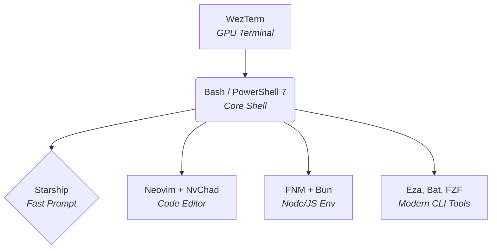

# 🛠️ Cross-Platform Dotfiles & Dev Environment


Bộ cấu hình (dotfiles) cá nhân hóa môi trường phát triển trên **Windows 11 / 10** và **Linux / WSL** với **PowerShell 7 / Bash / Zsh**, **WezTerm**, **Neovim (NvChad)** và script tự động hóa cài đặt 1 chạm.

---

## 📑 Mục lục

- [Tổng quan](#-tổng-quan)
- [Cấu trúc thư mục](#-cấu-trúc-thư-mục)
- [Hướng dẫn cài đặt](#-hướng-dẫn-cài-đặt)
  - [1. Dành cho Windows](#1-dành-cho-windows)
  - [2. Dành cho Linux / WSL / macOS](#2-dành-cho-linux--wsl--macos)
- [Các thành phần chính](#-các-thành-phần-chính)
- [Phím tắt & Lệnh tiện ích](#-phím-tắt--lệnh-tiện-ích)

---

## 🌊 My Workflow & Tech Stack

Luồng làm việc (workflow) của dotfiles này được xây dựng trên sự kết hợp của những công cụ hiện đại và tốc độ nhất hiện nay:



- **Terminal:** [WezTerm](https://wezfurlong.org/wezterm/) (Hiển thị mượt mà bằng GPU, cấu hình bằng Lua, tích hợp hiển thị RAM realtime).
- **Core Shell:** [PowerShell 7 (`pwsh`)](https://github.com/PowerShell/PowerShell) (cho Windows) và **Bash/Zsh** (cho Linux/macOS).
- **Prompt:** [Starship](https://starship.rs/) (Siêu nhanh, viết bằng Rust, hiển thị context thông minh).
- **Editor:** [Neovim](https://neovim.io/) đi kèm [NvChad](https://nvchad.com/) (Nhẹ, đẹp, đầy đủ IDE features như LSP & Treesitter).
- **Dev Environment:** [FNM](https://github.com/Schniz/fnm) (Fast Node Manager) kết hợp với [Bun](https://bun.sh/) để tối đa hóa tốc độ chạy/cài đặt JavaScript.
- **Modern CLI:** Sử dụng `eza` (thay cho `ls`), `bat` (thay cho `cat`), `fzf` + `ripgrep` (tìm kiếm file siêu tốc).

---

## 📂 Cấu trúc thư mục

```text
dotfiles/
│   ├── install.sh              # Cài đặt cho Linux
│   ├── uninstall.ps1           # Gỡ cài đặt cho Windows
│   ├── uninstall.sh            # Gỡ cài đặt cho Linux
│   └── generate_theme.py       # Trình biên dịch màu
├── nvim/                       # Cấu hình Neovim (NvChad)
│   ├── init.lua
│   ├── lazy-lock.json
│   └── lua/
├── bin/                        # Công cụ dòng lệnh CLI (dot)
│   ├── dot                     # Bash script (Linux/macOS)
│   └── dot.ps1                 # PowerShell script (Windows)
├── powershell/                 # Cấu hình PowerShell
│   ├── user_profile.ps1        # Profile chính ($PROFILE)
│   └── functions.ps1           # Các hàm & alias tiện ích
├── shell/                      # Cấu hình Bash / Zsh cho Linux
│   └── .bashrc
├── scoop/                      # Scoop config
│   └── config.json
├── themes/                     # Theme Engine (JSON Source of Truth)
│   ├── theme.json
│   └── generated/              # Chứa các file màu đã biên dịch (Lua, sh, ps1)
├── wezterm/                    # Cấu hình WezTerm (Cross-platform)
│   ├── wezterm.lua             # Entry point
│   ├── core.lua                # Cấu hình font, phím tắt
│   ├── ui.lua                  # Giao diện, tab bar
│   └── status.lua              # Hiển thị RAM realtime (tương thích Windows & Linux)
└── README.md
```

---

## 🚀 Hướng dẫn cài đặt

### 1. Dành cho Windows

Mở **PowerShell** trên máy mới và dán lệnh duy nhất sau:

```powershell
Set-ExecutionPolicy RemoteSigned -Scope CurrentUser -Force; irm https://raw.githubusercontent.com/kachitaro/dotfiles/main/scripts/install.ps1 | iex
```

> **Script tự động:** Cài Scoop, Git, Neovim, Font JetBrainsMono, WezTerm, FNM, Docker, WSL2, tạo Symlink và nạp Profile PowerShell.

---

### 2. Dành cho Linux / WSL / macOS

Mở **Terminal** và chạy lệnh duy nhất sau:

```bash
curl -fsSL https://raw.githubusercontent.com/kachitaro/dotfiles/main/scripts/install.sh | bash
```

> **Script tự động:** Cài đặt các công cụ CLI (`neovim`, `ripgrep`, `fd`, `fzf`, `bat`, `eza`), tải Font JetBrainsMono NF, cài `starship`, `fnm` (Node 22) và Bun và liên kết cấu hình `nvim`, `wezterm`, `bashrc`/`zshrc`.

---

### 3. Chạy trực tiếp từ repo (Nếu đã clone về máy)

- **Windows:** `.\scripts\install.ps1`
- **Linux:** `chmod +x ./scripts/install.sh && ./scripts/install.sh`

> [!IMPORTANT]
> Sau khi cài đặt trên Windows, hãy **khởi động lại máy tính (Restart)** để áp dụng kích hoạt Hyper-V, WSL và Font.
> Trên Linux, hãy chạy `source ~/.bashrc` hoặc mở tab terminal mới.

---

### 4. Nâng cao: Cài đè (Overwrite) và Gỡ cài đặt (Uninstall)

- **Cài đè (Bỏ qua sao lưu):** Nếu bạn muốn xóa hẳn file config cũ thay vì đổi tên thành `.bak_...`:
  - **Windows:** `.\scripts\install.ps1 -ForceInstall`
  - **Linux/macOS:** `./scripts/install.sh --force`

- **Gỡ cài đặt (Xóa symlinks):** Trả lại môi trường gốc (xóa các file symlink của wezterm, nvim và gỡ nạp từ .bashrc/.zshrc/profile):
  - **Windows:** `.\scripts\uninstall.ps1`
  - **Linux/macOS:** `./scripts/uninstall.sh`

---

### 5. Quản lý hệ thống bằng CLI (`dot`)

Sau khi cài đặt, bạn sẽ được trang bị một lệnh hệ thống tên là `dot`. Đây là công cụ trung tâm để quản lý toàn bộ cấu hình:

```bash
dot install          # Chạy script cài đặt (giống ./install)
dot install --force  # Ép cài đè (không tạo file .bak)
dot add <path>       # ⚡ Thu nạp một config mới vào kho (vd: dot add ~/.config/tmux)
dot eject            # ⚡ Gỡ bỏ symlink, copy file thật trả lại máy tính (An toàn)
dot uninstall        # Chạy lệnh gỡ cài đặt hoàn toàn
dot theme reload     # Biên dịch và áp dụng màu mới từ theme.json
dot update           # Kéo (pull) bản cập nhật mới nhất từ GitHub
dot help             # Hiển thị menu trợ giúp
```

---

## 🎨 Hệ thống Theme Engine (Dùng chung bộ màu)

Dotfiles này được trang bị một "Theme Engine" mini giúp đồng bộ màu sắc cho toàn bộ hệ thống (Neovim, WezTerm, Starship, Bash, PowerShell).

- **Nguồn sự thật:** Định nghĩa/Thay đổi màu trong file `themes/theme.json`.
- **Áp dụng:** Mở terminal và chạy lệnh:
  ```bash
  dot theme reload
  ```
- **Kết quả:** Script Python (`scripts/generate_theme.py`) sẽ tự động biên dịch bảng màu JSON ra Lua, Shell, PS1. WezTerm sẽ bắt sự kiện thay đổi và tự động load lại màu (không cần khởi động lại), Neovim và môi trường Shell cũng áp dụng bộ màu mới tức thì ở phiên làm việc tiếp theo.

---

## ⌨️ Phím tắt & Lệnh tiện ích

### WezTerm

| Phím tắt | Thao tác |
| :--- | :--- |
| `Ctrl + Shift + \|` | Chia đôi màn hình theo chiều dọc (Split Horizontal) |
| `Ctrl + Shift + D` | Chia đôi màn hình theo chiều ngang (Split Vertical) |

### PowerShell & FZF

| Phím tắt / Lệnh | Mô tả |
| :--- | :--- |
| `Ctrl + R` | Tìm kiếm lịch sử dòng lệnh tương tác (FZF History) |
| `Ctrl + F` | Tìm kiếm đường dẫn file/thư mục tương tác (FZF Provider) |
| `Ctrl + D` | Xóa ký tự hiện tại (Emacs keybinding) |
| `Get-SystemSizeReport` | Xem bảng phân tích dung lượng ổ đĩa Windows |
| `Get-AppSizeReport` | Liệt kê dung lượng các ứng dụng đang chiếm dụng ổ cứng |
| `ll` / `la` | Liệt kê file với icon & thông tin chi tiết (`eza`) |
| `cd...` / `cd....` | Di chuyển lên 2 / 3 cấp thư mục |

---

## 🤝 Dành cho cộng đồng (Mã nguồn mở)

Dự án này là mã nguồn mở. Bạn hoàn toàn có thể Fork dự án này về để tạo ra bộ Dotfiles mang đậm dấu ấn cá nhân của riêng bạn!

**Cách tạo bộ dotfiles của riêng bạn:**
1. Nhấn nút **Fork** ở góc trên cùng bên phải của Repository này.
2. Mở file `scripts/install.sh` và `scripts/install.ps1`, tìm kiếm chuỗi `kachitaro/dotfiles` và thay bằng `<username_của_bạn>/dotfiles`.
3. Khi bạn cài phần mềm mới trên máy, chỉ cần chạy lệnh `dot add <đường_dẫn>` (ví dụ `dot add ~/.config/tmux`) để thu nạp cấu hình mới.
4. Push lên GitHub, và từ nay bạn cũng có lệnh cài đặt 1 chạm cho riêng mình!

---

## 📜 License

[MIT](LICENSE) © [kachitaro](https://github.com/kachitaro)