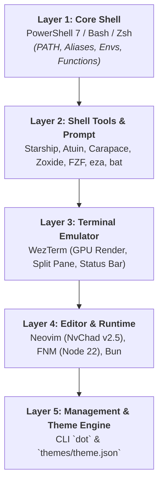

# 🛠️ Cross-Platform Dotfiles & Dev Environment


[](https://ko-fi.com/anhtai2k)


🌐 **Language**: **English** | [Tiếng Việt](README.vi.md)

A personal dotfiles suite engineered with an **Inside-Out Architecture** — starting from the core **Core Shell** (PowerShell 7 / Bash / Zsh), extending to modern command-line tools, **WezTerm** GPU terminal emulator, **Neovim (NvChad)** IDE, and globally managed via the custom `dot` CLI & **Theme Engine**.

Rebuild your entire development environment on **Windows 11/10** and **Linux / WSL / macOS** with a single command.

---

## 📸 Showcase & Preview

## 

## 📑 Table of Contents

- [📸 Showcase & Preview](#-showcase--preview)
- [🏗️ Inside-Out Architecture](#️-inside-out-architecture)
- [📂 Directory Structure](#-directory-structure)
- [🚀 Installation Guide](#-installation-guide)
- [🧰 Management with `dot` CLI](#-management-with-dot-cli)
- [🎨 Theme Engine (System-wide Color Sync)](#-theme-engine-system-wide-color-sync)
- [⌨️ Keybindings & Utilities](#️-keybindings--utilities)
- [☕ Support / Donate](#-support--donate)
- [📜 License](#-license)

---

## 🏗️ Inside-Out Architecture

The dotfiles system is organized from the deepest execution core out to the UI presentation layer:



### 🎯 5-Layer Breakdown:

| Layer | Name                          | Core Components                                | Roles & Features                                                                                                                                                                                         |
| :---- | :---------------------------- | :--------------------------------------------- | :------------------------------------------------------------------------------------------------------------------------------------------------------------------------------------------------------- |
| **1** | **Core Shell**                | `powershell/`, `shell/.bashrc`, `shell/.zshrc` | Manages environment variables (`PATH`), standard aliases (`g`, `ls`→`eza`, `cat`→`bat`), system functions (`Get-SystemSizeReport`), and JS Runtimes (`FNM`, `Bun`).                                      |
| **2** | **Shell Tools & Prompt**      | `starship/`, `atuin/`, `carapace/`             | **Starship** fast contextual prompt; **Atuin** SQLite shell history (`Ctrl+R`); **Carapace** multi-shell auto-completion; **Zoxide** smart directory navigation (`z`); **FZF** interactive fuzzy finder. |
| **3** | **Terminal Emulator**         | `wezterm/`                                     | GPU-accelerated terminal emulator, flexible pane splitting, real-time RAM usage in status bar, bundled **JetBrainsMono Nerd Font**.                                                                      |
| **4** | **Editor & Dev Stack**        | `nvim/`                                        | **Neovim** pre-configured on **NvChad v2.5** (LSP, Treesitter, Auto-format), pre-integrated with Node 22 (FNM) and Bun.                                                                                  |
| **5** | **Management & Theme Engine** | `bin/dot`, `themes/`                           | `dot` CLI for adoption (`add`), unlinking (`eject`), install/uninstall; **Theme Engine** synchronizes system-wide colors from `themes/theme.json`.                                                       |

---

## 📂 Directory Structure

```text
dotfiles/
├── shell/                   # [Layer 1] Bash (.bashrc) and Zsh (.zshrc) configurations
├── powershell/              # [Layer 1] PowerShell 7 configurations (user_profile.ps1, functions.ps1)
├── starship/                # [Layer 2] Starship Prompt configuration (starship.toml)
├── atuin/                   # [Layer 2] Atuin SQLite Shell History configuration (config.toml)
├── carapace/                # [Layer 2] Carapace Multi-shell Completion overlays
├── wezterm/                 # [Layer 3] WezTerm Terminal configuration (Lua GPU Engine)
├── nvim/                    # [Layer 4] Neovim configuration (NvChad v2.5 IDE)
├── scoop/                   # [Layer 4] Scoop Package Manager configuration (Windows)
├── bin/                     # [Layer 5] `dot` management CLI (Bash / PowerShell / Batch)
├── themes/                  # [Layer 5] Theme Engine (Single Source of Truth: theme.json)
├── assets/                  # Documentation images and previews
├── scripts/                 # Automation scripts (install, uninstall, add, eject, generate_theme)
├── install.ps1              # One-liner Installer for Windows
├── install.sh               # One-liner Installer for Linux / macOS
└── README.md
```

---

## 🚀 Installation Guide

### 1. Windows (PowerShell)

Open **PowerShell** (Run as Administrator recommended for full setup) and run:

```powershell
# ⚡ Fast Install: Downloads dot CLI binary & syncs configs immediately
irm https://raw.githubusercontent.com/kachitaro/dotfiles/main/install.ps1 | iex

# 🚀 Full Machine Setup: Installs Scoop, Neovim, WezTerm, Font, Node, Tools & virtualization
& ([scriptblock]::Create((irm https://raw.githubusercontent.com/kachitaro/dotfiles/main/install.ps1))) -Full
```

### 2. Linux / macOS

Open **Terminal** and run:

```bash
# ⚡ Fast Install: Downloads pre-built dot binary & syncs configs immediately
curl -fsSL https://raw.githubusercontent.com/kachitaro/dotfiles/main/install.sh | bash

# 🚀 Full Machine Setup: Installs system packages (apt/brew/pacman), Neovim, WezTerm, Font, Node & Tools
curl -fsSL https://raw.githubusercontent.com/kachitaro/dotfiles/main/install.sh | bash -s -- --full
```

### 3. Run Directly from Cloned Repo

```bash
# Windows
.\install.ps1        # or .\install.ps1 -Full

# Linux/macOS
./install.sh         # or ./install.sh --full
```


> [!IMPORTANT]
> After installing on Windows, **restart your machine** to apply Hyper-V, WSL, and font settings. On Linux/macOS, run `source ~/.bashrc` or open a new terminal tab.

### 4. Overwrite & Uninstall

| Action                                              | Windows                       | Linux/macOS              |
| :-------------------------------------------------- | :---------------------------- | :----------------------- |
| Overwrite (skip backup)                             | `.\install.ps1 -ForceInstall` | `./install.sh --force`   |
| Uninstall (remove symlinks, restore original shell) | `.\scripts\uninstall.ps1`     | `./scripts/uninstall.sh` |

---

## 🧰 Management with `dot` CLI (Rust-powered)

The management CLI (`k-dot` / `dot`) is written in **Rust** for blazing-fast startup, robust cross-platform path resolution, and native symlink handling without runtime dependencies.

```bash
dot install                      # Run system installer (Options: --force / -ForceInstall)
dot add <path>                   # Adopt a config folder into repo (e.g. dot add ~/.config/alacritty)
dot eject                        # Unlink dotfiles and restore independent real files to system
dot inject                       # Re-link dotfiles symlinks and configurations into system (Options: --force)
dot uninstall                    # Fully uninstall dotfiles
dot theme reload                 # Recompile and apply theme from theme.json
dot theme path                   # Print absolute path of themes/generated directory (for dynamic scripts)
dot update                       # Pull the latest updates from GitHub
dot --help                       # Display help menu
```

### 🦀 Build CLI from Source

To compile the CLI binary manually:

```bash
cd cli
cargo build --release
```

#### Cross-compilation Targets:
- **Windows (MSVC)**: `cargo build --release --target x86_64-pc-windows-msvc`
- **Linux (x86_64)**: `cargo build --release --target x86_64-unknown-linux-gnu`
- **macOS (Apple Silicon)**: `cargo build --release --target aarch64-apple-darwin`


---

## 🎨 Theme Engine (System-wide Color Sync)

All colors across Neovim, WezTerm, Starship, Bash, Zsh, and PowerShell are synchronized from a **single source of truth**: `themes/theme.json`.

1. Edit colors in `themes/theme.json`.
2. Run `dot theme reload`.
3. The built-in Rust Theme Engine compiles JSON into `theme.lua`, `theme.sh`, `theme.ps1`, `theme.toml`, and `atuin/themes/theme.toml` under `themes/generated/`.
4. WezTerm, Neovim, and Shell dynamically pick up the new colors instantly.

Current default theme: **Catppuccin Mocha**.

---

## ⌨️ Keybindings & Utilities

### WezTerm (Layer 3)

| Keybinding          | Action                  |
| :------------------ | :---------------------- |
| `Ctrl + Shift + \|` | Split pane vertically   |
| `Ctrl + Shift + D`  | Split pane horizontally |

### Core Shell & Shell Tools (Layers 1 & 2)

| Keybinding / Command   | Description                                                                       |
| :--------------------- | :-------------------------------------------------------------------------------- |
| `<Tab>`                | Carapace Auto-completion (Detailed suggestions for `git`, `docker`, `kubectl`...) |
| `Ctrl + R`             | Command history search (Atuin SQLite History / FZF)                               |
| `Ctrl + F`             | Interactive file/folder path search using FZF                                     |
| `z <dir>`              | Quick jump to directory via Zoxide                                                |
| `Get-SystemSizeReport` | View Windows disk usage report                                                    |
| `Get-AppSizeReport`    | List installed applications by disk size                                          |
| `ll` / `la`            | List files with icons & details (`eza`)                                           |
| `cd...` / `cd....`     | Navigate up 2 / 3 directory levels                                                |

---

## ☕ Support / Donate

If you find this dotfiles setup helpful, feel free to support with a coffee!

[](https://ko-fi.com/anhtai2k)

---

## 📜 License

[MIT](LICENSE) © [kachitaro](https://github.com/kachitaro)
