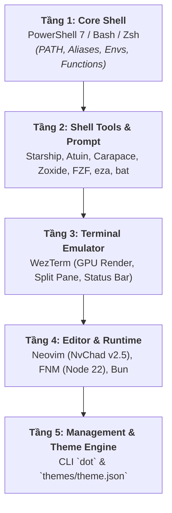

# 🛠️ Cross-Platform Dotfiles & Dev Environment


[](https://ko-fi.com/anhtai2k)


Bộ dotfiles cá nhân được thiết kế theo **kiến trúc phân lớp từ trong ra ngoài (Inside-Out Architecture)** — xuất phát từ lõi **Core Shell** (PowerShell 7 / Bash / Zsh), mở rộng sang các công cụ dòng lệnh hiện đại, Terminal **WezTerm**, Editor **Neovim (NvChad)**, và được quản lý toàn cục bằng CLI `dot` cùng **Theme Engine**.

Dựng lại toàn bộ môi trường phát triển trên **Windows 11/10** và **Linux / WSL / macOS** chỉ với một lệnh duy nhất.

---

## 📑 Mục lục

- [🏗️ Kiến trúc phân lớp (Inside-Out)](#️-kiến-trúc-phân-lớp-inside-out)
- [📂 Cấu trúc thư mục](#-cấu-trúc-thư-mục)
- [🚀 Hướng dẫn cài đặt](#-hướng-dẫn-cài-đặt)
- [🧰 Quản lý bằng CLI `dot`](#-quản-lý-bằng-cli-dot)
- [🎨 Theme Engine (Đồng bộ màu toàn hệ thống)](#-theme-engine-đồng-bộ-màu-toàn-hệ-thống)
- [⌨️ Phím tắt & Tiện ích](#-phím-tắt--tiện-ích)
- [☕ Ủng hộ / Donate](#-ủng-hộ--donate)
- [📜 License](#-license)

---

## 🏗️ Kiến trúc phân lớp (Inside-Out)

Hệ thống dotfiles được sắp xếp từ lõi thực thi sâu nhất ra ngoài lớp giao diện:



### 🎯 Chi tiết 5 tầng hệ thống:

| Tầng | Tên tầng | Thành phần chính | Vai trò & Chức năng |
| :--- | :--- | :--- | :--- |
| **1** | **Core Shell** (Lõi) | `powershell/`, `shell/.bashrc`, `shell/.zshrc` | Quản lý biến môi trường (`PATH`), alias chuẩn (`g`, `ls`→`eza`, `cat`→`bat`), hàm hệ thống (`Get-SystemSizeReport`), nạp JS Runtime (`FNM`, `Bun`). |
| **2** | **Shell Tools & Prompt** | `starship/`, `atuin/`, `carapace/` | **Starship** hiển thị prompt ngữ cảnh nhanh; **Atuin** quản lý lịch sử dòng lệnh SQLite (`Ctrl+R`); **Carapace** gợi ý lệnh tự động; **Zoxide** chuyển thư mục thông minh (`z`); **FZF** tìm kiếm file/lịch sử. |
| **3** | **Terminal Emulator** | `wezterm/` | Giả lập Terminal bằng GPU, chia màn hình linh hoạt, hiển thị RAM realtime trên tab bar, nạp font **JetBrainsMono Nerd Font**. |
| **4** | **Editor & Dev Stack** | `nvim/` | **Neovim** cấu hình sẵn trên nền **NvChad v2.5** (LSP, Treesitter, Auto-format), tích hợp sẵn Node 22 (FNM) và Bun. |
| **5** | **Management & Theme Engine** | `bin/dot`, `themes/` | CLI `dot` thu nạp (`add`), hoàn trả (`eject`), cài đặt/gỡ bỏ; **Theme Engine** đồng bộ màu sắc toàn bộ hệ thống từ `themes/theme.json`. |

---

## 📂 Cấu trúc thư mục

Thư mục repository được tổ chức tương ứng theo các tầng kiến trúc:

```text
dotfiles/
├── shell/                   # [Tầng 1] Cấu hình Bash (.bashrc) và Zsh (.zshrc)
├── powershell/              # [Tầng 1] Cấu hình PowerShell 7 (user_profile.ps1, functions.ps1)
├── starship/                # [Tầng 2] Cấu hình Starship Prompt (starship.toml)
├── atuin/                   # [Tầng 2] Cấu hình Atuin SQLite Shell History (config.toml)
├── carapace/                # [Tầng 2] Cấu hình Carapace Multi-shell Completion (overlays/)
├── wezterm/                 # [Tầng 3] Cấu hình WezTerm Terminal (Lua GPU Engine)
├── nvim/                    # [Tầng 4] Cấu hình Neovim (NvChad v2.5 IDE)
├── scoop/                   # [Tầng 4] Cấu hình Scoop Package Manager (Windows)
├── bin/                     # [Tầng 5] CLI quản trị `dot` (Bash / PowerShell / Batch)
├── themes/                  # [Tầng 5] Theme Engine (Nguồn sự thật: theme.json)
├── scripts/                 # Scripts tự động hoá (install, uninstall, add, eject, generate_theme)
├── install.ps1              # One-liner Installer cho Windows
├── install.sh               # One-liner Installer cho Linux / macOS
└── README.md
```

---

## 🚀 Hướng dẫn cài đặt

### 1. Windows

Mở **PowerShell 7** và chạy:

```powershell
Set-ExecutionPolicy RemoteSigned -Scope CurrentUser -Force
irm https://raw.githubusercontent.com/kachitaro/dotfiles/main/install.ps1 | iex
```

> Script tự động cài Scoop, Git, Neovim, font JetBrainsMono NF, WezTerm, FNM (Node 22), Bun, tạo symlink và nạp profile PowerShell.
> Lệnh `dot` sẽ tự động khả dụng trên toàn hệ thống ngay sau khi cài đặt.

**Các tuỳ chọn cài đặt:**

| Tham số | Ý nghĩa |
| :--- | :--- |
| `-SkipFeatures` | Bỏ qua kích hoạt tính năng ảo hoá Windows (`Hyper-V`, `WSL2`, `Containers`) |
| `-ForceInstall` | Ép ghi đè các cấu hình hiện có, không tạo backup `.bak_*` |

### 2. Linux / WSL / macOS

Mở **Terminal** và chạy:

```bash
curl -fsSL https://raw.githubusercontent.com/kachitaro/dotfiles/main/install.sh | bash
```

> Script tự động cài `neovim`, `ripgrep`, `fd`, `fzf`, `bat`, `eza`, `carapace`, font JetBrainsMono NF, `starship`, `fnm` (Node 22), Bun, và tạo symlink cấu hình `nvim`, `wezterm`, `starship`, `atuin`, `carapace`, `bashrc`/`zshrc`.

### 3. Chạy trực tiếp từ repo đã clone

```bash
# Windows
.\install.ps1
# hoặc dùng dot CLI
.\bin\dot.ps1 install

# Linux/macOS
chmod +x ./install.sh && ./install.sh
```

> [!IMPORTANT]
> Sau khi cài trên Windows, **khởi động lại máy** để áp dụng Hyper-V, WSL và font. Trên Linux/macOS, chạy `source ~/.bashrc` hoặc mở tab terminal mới.

### 4. Cài đè & gỡ cài đặt

| Thao tác | Windows | Linux/macOS |
| :--- | :--- | :--- |
| Cài đè, bỏ qua sao lưu | `.\install.ps1 -ForceInstall` | `./install.sh --force` |
| Gỡ cài đặt (xoá symlink, khôi phục môi trường gốc) | `.\scripts\uninstall.ps1` | `./scripts\uninstall.sh` |

---

## 🧰 Quản lý bằng CLI `dot`

Sau khi cài đặt, bạn có sẵn lệnh `dot` để quản lý toàn bộ dotfiles:

```bash
dot install                      # Chạy script cài đặt hệ thống
dot install -ForceInstall        # Ép cài đè, không tạo backup
dot add <path>                   # Thu nạp một config từ ~/.config vào kho (vd: dot add ~/.config/alacritty)
dot eject                        # Gỡ symlink, trả file thực về máy (hoạt động độc lập)
dot uninstall                    # Gỡ cài đặt hoàn toàn
dot theme reload                 # Biên dịch và áp dụng theme mới từ theme.json
dot update                       # Pull bản cập nhật mới nhất từ GitHub
dot help                         # Hiển thị menu trợ giúp
```

---

## 🎨 Theme Engine — đồng bộ màu toàn hệ thống

Toàn bộ màu sắc của Neovim, WezTerm, Starship, Bash, Zsh và PowerShell được đồng bộ từ **một nguồn sự thật duy nhất**: `themes/theme.json`.

1. Sửa màu trong `themes/theme.json`.
2. Chạy `dot theme reload`.
3. `scripts/generate_theme.py` biên dịch JSON ra `theme.lua`, `theme.sh`, `theme.ps1` trong `themes/generated/`.
4. WezTerm, Neovim và Shell tự động nhận diện vị trí dotfiles động (hỗ trợ mọi đường dẫn clone tuỳ chỉnh hoặc symlink) và áp dụng màu mới ngay lập tức.

Theme mặc định hiện tại: **Catppuccin Mocha**.

---

## ⌨️ Phím tắt & Tiện ích

### WezTerm (Tầng 3)

| Phím tắt | Thao tác |
| :--- | :--- |
| `Ctrl + Shift + \|` | Chia màn hình theo chiều dọc |
| `Ctrl + Shift + D` | Chia màn hình theo chiều ngang |

### Core Shell & Shell Tools (Tầng 1 & 2)

| Phím tắt / Lệnh | Mô tả |
| :--- | :--- |
| `<Tab>` | Carapace Auto-completion (Gợi ý lệnh chi tiết cho `git`, `docker`, `kubectl`...) |
| `Ctrl + R` | Tra cứu lịch sử dòng lệnh (Atuin SQLite History / FZF) |
| `Ctrl + F` | Tìm kiếm đường dẫn file/thư mục tương tác bằng FZF |
| `Ctrl + D` | Xoá ký tự hiện tại (Emacs keybinding) |
| `z <thư-mục>` | Nhảy nhanh tới thư mục bất kỳ bằng Zoxide |
| `Get-SystemSizeReport` | Xem báo cáo dung lượng ổ đĩa Windows |
| `Get-AppSizeReport` | Liệt kê dung lượng các ứng dụng đang chiếm ổ cứng |
| `ll` / `la` | Liệt kê file với icon & chi tiết (`eza`) |
| `cd...` / `cd....` | Di chuyển lên 2 / 3 cấp thư mục |

---

## ☕ Ủng hộ / Donate

Nếu bạn thấy bộ dotfiles này hữu ích, hãy ủng hộ mình một tách cà phê nhé!

[](https://ko-fi.com/anhtai2k)

---

## 📜 License

[MIT](LICENSE) © [kachitaro](https://github.com/kachitaro)
