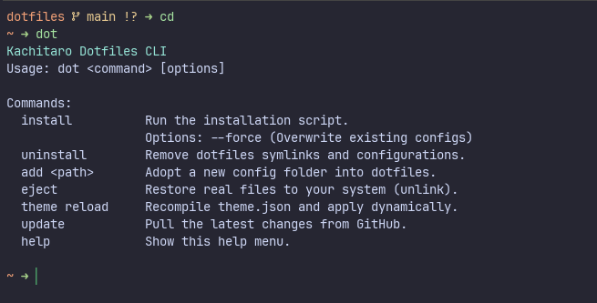

# 🛠️ Cross-Platform Dotfiles & Dev Environment


[](https://ko-fi.com/anhtai2k)


🌐 **Language**: **English** | [Tiếng Việt](README.vi.md)

A personal cross-platform dotfiles suite for **PowerShell 7**, **Bash / Zsh**, modern CLI tools, **WezTerm** GPU terminal emulator, and **Neovim (NvChad)** IDE, powered by a native Rust management CLI (`k-dot` / `dot`) & **Theme Engine**.

Rebuild your development environment on **Windows 11/10** and **Linux / WSL / macOS** with a single command.

---

## 📸 Showcase & Preview



## 📑 Table of Contents

- [📸 Showcase & Preview](#-showcase--preview)
- [📁 Repository Structure](#-repository-structure)
- [🚀 Installation Guide](#-installation-guide)
- [🔄 Migration Guide (For Existing Users)](#-migration-guide-for-existing-users)
- [🧰 Management with `dot` CLI](#-management-with-dot-cli)
- [🎨 Theme Engine (System-wide Color Sync)](#-theme-engine--shell-cache-system-wide-color-sync--fast-startup)
- [⌨️ Keybindings & Utilities](#️-keybindings--utilities)
- [☕ Support / Donate](#-support--donate)
- [📜 License](#-license)

---

## 📁 Repository Structure

```
dotfiles/
├── apps/                    # 📦 Application configurations (Auto-discovered by 'dot')
│   ├── atuin/               # Shell history sync & fuzzy search
│   ├── bat/                 # Syntax-highlighted cat alternative
│   ├── nvim/                # Neovim IDE configuration (NvChad)
│   ├── powershell/          # PowerShell 7 profile & functions
│   ├── scoop/               # Scoop package manager configs
│   ├── shell/               # POSIX Shell profiles (.bashrc, .zshrc)
│   ├── starship/            # Starship cross-shell prompt
│   └── wezterm/             # WezTerm GPU terminal emulator
├── cli/                     # 🦀 Native Rust CLI ('dot' / 'k-dot')
├── themes/                  # 🎨 Single-source-of-truth Theme Engine
│   ├── theme.json           # Palette configuration (Catppuccin Mocha)
│   └── generated/           # Compiled theme & cached shell init scripts
├── install.ps1              # Windows setup script
├── install.sh               # Linux/macOS setup script
└── README.md                # Documentation
```

---

## 🚀 Installation Guide

### 1. Windows (PowerShell)

Open **PowerShell** (Run as Administrator recommended for full setup) and run:

```powershell
# ⚡ Fast Install: Downloads dot CLI binary & syncs configs immediately
irm https://raw.githubusercontent.com/kachitaro/dotfiles/main/install.ps1 | iex

# 🚀 Full Machine Setup: Installs Scoop, Neovim, WezTerm, Font, Node, Tools & virtualization
& ([scriptblock]::Create((irm https://raw.githubusercontent.com/kachitaro/dotfiles/main/install.ps1))) -Full
```

### 2. Linux / macOS

Open **Terminal** and run:

```bash
# ⚡ Fast Install: Downloads pre-built dot binary & syncs configs immediately
curl -fsSL https://raw.githubusercontent.com/kachitaro/dotfiles/main/install.sh | bash

# 🚀 Full Machine Setup: Installs system packages (apt/brew/pacman), Neovim, WezTerm, Font, Node & Tools
curl -fsSL https://raw.githubusercontent.com/kachitaro/dotfiles/main/install.sh | bash -s -- --full
```

### 3. Run Directly from Cloned Repo

```bash
# Windows
.\install.ps1        # or .\install.ps1 -Full

# Linux/macOS
./install.sh         # or ./install.sh --full
```

> [!IMPORTANT]
> After installing on Windows, **restart your machine** to apply Hyper-V, WSL, and font settings. On Linux/macOS, run `source ~/.bashrc` or open a new terminal tab.

### 4. Overwrite & Uninstall

| Action                                              | Windows                       | Linux/macOS              |
| :-------------------------------------------------- | :---------------------------- | :----------------------- |
| Overwrite (skip backup)                             | `.\install.ps1 -ForceInstall` | `./install.sh --force`   |
| Uninstall (remove symlinks, restore original shell) | `dot uninstall`               | `dot uninstall`          |

---

## 🔄 Migration Guide (For Existing Users)

If you previously installed/cloned this dotfiles suite with the old flat root structure, follow these steps to transition cleanly to the `apps/` structure:

```bash
# 1. Unlink legacy symlinks pointing to old root paths
dot eject

# 2. Pull the latest repository changes containing the apps/ directory
git pull

# 3. (If using prebuilt CLI) Update your dot binary
dot update

# 4. Re-link all configurations to the new apps/ structure
dot inject --force
```

---

## 🧰 Management with `dot` CLI (Rust-powered)

The management CLI (`k-dot` / `dot`) is written in **Rust** for blazing-fast startup, robust cross-platform path resolution, and native symlink handling without runtime dependencies.

```bash
dot init [path]                  # Initialize standalone dotfiles workspace (default ~/.dotfiles) with starter theme.json
dot install                      # Run system installer (Options: --force / -ForceInstall)
dot update                       # Self-update CLI binary (dot) to latest version from GitHub Release
dot add <path>                   # Adopt a config into apps/ folder (e.g. dot add ~/.config/alacritty)
dot eject                        # Unlink dotfiles and restore independent real files to system
dot inject                       # Re-link dotfiles symlinks and configurations into system (Options: --force)
dot uninstall                    # Fully uninstall dotfiles
dot theme reload                 # Recompile and apply theme from theme.json
dot theme path                   # Print absolute path of themes/generated directory (for dynamic scripts)
dot --help                       # Display help menu
```

### 🦀 Build CLI from Source

To compile the CLI binary manually:

```bash
cd cli
cargo build --release
```

#### Cross-compilation Targets:
- **Windows (MSVC)**: `cargo build --release --target x86_64-pc-windows-msvc`
- **Linux (x86_64)**: `cargo build --release --target x86_64-unknown-linux-gnu`
- **macOS (Apple Silicon)**: `cargo build --release --target aarch64-apple-darwin`

---

## 🎨 Theme Engine & Shell Cache (System-wide Color Sync & Fast Startup)

All colors across Neovim, WezTerm, Starship, Bash, Zsh, and PowerShell are synchronized from a **single source of truth**: `themes/theme.json`.

1. Edit colors in `themes/theme.json`.
2. Run `dot theme reload` (or `dot inject`).
3. The built-in Rust Theme Engine compiles JSON and freezes shell initialization output directly into:
   - `themes/generated/theme.lua` (WezTerm & Neovim)
   - `themes/generated/theme.sh` (Bash & Zsh)
   - `themes/generated/theme.ps1` (PowerShell)
   - `themes/generated/init.zsh` / `init.bash` / `init.ps1` (Precompiled static init scripts for instant shell startup)
   - `apps/atuin/themes/theme.toml` (Atuin Shell History)
   - `apps/starship/starship.toml` (Starship Prompt Palette)
4. WezTerm, Neovim, and Shell dynamically pick up the new colors instantly, and terminal startup times are significantly reduced by eliminating dynamic subprocess evals.

Current default theme: **Catppuccin Mocha**.

---

## ⌨️ Keybindings & Utilities

### WezTerm

| Keybinding          | Action                  |
| :------------------ | :---------------------- |
| `Ctrl + Shift + \|` | Split pane vertically   |
| `Ctrl + Shift + D`  | Split pane horizontally |

### Core Shell & Shell Tools

| Keybinding / Command   | Description                                                                       |
| :--------------------- | :-------------------------------------------------------------------------------- |
| `Ctrl + R`             | **Atuin** interactive history search (with full duration, exit code, timestamp)   |
| `Ctrl + F`             | **PSFzf / FZF** file finder                                                       |
| `z <dir>`              | **Zoxide** jump to frequently used directory                                      |
| `g`                    | Alias for `git`                                                                   |
| `ls`, `ll`, `la`, `lt` | **Eza** modern file listings (icons, git status, tree view)                       |
| `cat <file>`           | **Bat** file viewer with syntax highlighting and line numbers                     |
| `Get-SystemSizeReport` | *(PowerShell)* Detailed disk space analysis across dev directories and caches     |

---

## ☕ Support / Donate

If you find this dotfiles setup useful, consider supporting:

- **Ko-fi**: [ko-fi.com/anhtai2k](https://ko-fi.com/anhtai2k)
- **Star the repo**: ⭐ Leave a star on GitHub!

---

## 📜 License

Distributed under the **MIT License**. See `LICENSE` for more information.
